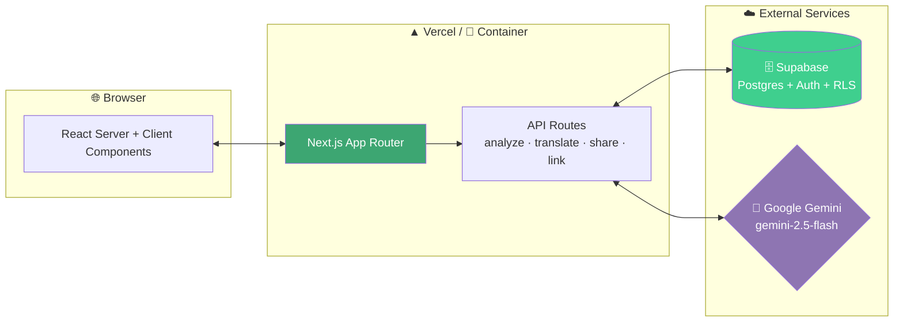
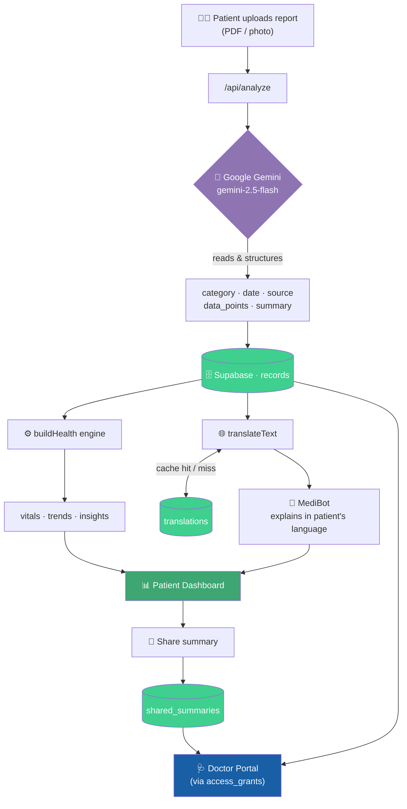
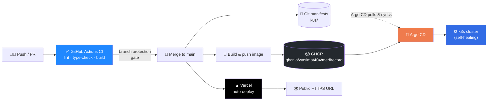

<div align="center">

<!-- LOGO PLACEHOLDER — drop a 120px logo at ./screenshots/logo.png -->


# 🩺 MediRecord

### Your entire medical history — read, understood, and explained in *your* language.

*Turning chaotic folders of prescriptions, bills, and lab reports into a clear, searchable, multilingual health record — for patients and the doctors who treat them.*

<!-- BANNER PLACEHOLDER — drop a wide banner at ./screenshots/banner.png -->

<br/>


<br/>


[**Live Demo**](https://medirecord.vercel.app) · [**Report Bug**](https://github.com/wasimat404/medirecord/issues) · [**Request Feature**](https://github.com/wasimat404/medirecord/issues)

</div>

---

> **MediRecord** is a full-stack, AI-powered medical records platform — *and* a complete, production-grade DevOps showcase. The application ingests messy medical documents, structures them with Google Gemini, and serves them back as a clean, multilingual health record. The repository around it demonstrates an end-to-end CI/CD pipeline: **GitHub Actions → Docker → GitHub Container Registry → Kubernetes (k3s) → Argo CD GitOps**, with a parallel **Vercel** deployment for the public demo.

---

## 📑 Table of Contents

- [The Problem](#-the-problem)
- [The Solution](#-the-solution)
- [Screenshots / Demo](#-screenshots--demo)
- [Architecture Overview](#-architecture-overview)
  - [System Design](#system-design)
  - [Application Data Flow](#application-data-flow)
  - [DevOps & Delivery Pipeline](#devops--delivery-pipeline)
- [Features](#-features)
- [Technology Stack](#-technology-stack)
- [Installation](#-installation)
- [Configuration](#-configuration)
- [Usage Guide](#-usage-guide)
- [API Documentation](#-api-documentation)
- [Project Structure](#-project-structure)
- [Development Guide](#-development-guide)
- [Testing](#-testing)
- [Security](#-security)
- [Performance Optimization](#-performance-optimization)
- [Deployment](#-deployment)
  - [Docker](#docker)
  - [Kubernetes (k3s)](#kubernetes-k3s)
  - [GitOps with Argo CD](#gitops-with-argo-cd)
  - [CI/CD Pipeline](#cicd-pipeline)
- [Monitoring & Logging](#-monitoring--logging)
- [Troubleshooting](#-troubleshooting)
- [FAQ](#-faq)
- [Roadmap](#-roadmap)
- [Contributing](#-contributing)
- [Versioning Strategy](#-versioning-strategy)
- [Support & Community](#-support--community)
- [Acknowledgements](#-acknowledgements)
- [License](#-license)
- [Maintainers & Contributors](#-maintainers--contributors)
- [Citation](#-citation)
- [Contact](#-contact)

---

## 🌍 The Problem

Anyone under ongoing treatment knows the folder. The one stuffed with prescriptions, lab reports, scan results, and hospital bills that grows thicker with every visit. That folder is a problem for *everyone* who touches it:

- 🧑‍🦱 **Patients** can't make sense of their own history — what's improving, what's getting worse, what a result even *means*.
- 🌐 **Language barriers** make it brutal. A lab report in clinical English is unreadable to a patient who speaks Bengali, Tamil, or Hindi. Critical health information goes un-understood.
- 🩺 **Doctors** waste precious minutes reconstructing a treatment timeline from a paper pile instead of treating.
- 💸 **Insurance** disbursal stalls because nobody can quickly assemble and verify the records.
- 📉 A folder is **dead data** — full of trends and signals that never get surfaced or used.

## ✨ The Solution

**MediRecord** ingests those documents, *reads* them with AI, and turns them into a living, structured, **multilingual** health record.

Upload a report → it's instantly parsed, categorized, summarized, and **translated into the patient's own language** → trends are tracked, the doctor gets a clean view, and a friendly assistant explains it all in plain words. The folder becomes a dashboard.

> [!NOTE]
> MediRecord is a portfolio project demonstrating both **product engineering** (a real, working healthcare app) and **platform engineering** (a complete CI/CD and GitOps delivery pipeline). It is not a certified medical device and should not be used for clinical decision-making.

---

## 📸 Screenshots / Demo

> 🔗 **Live application:** [medirecord.vercel.app](https://medirecord.vercel.app)
> _Place screenshots in a `/screenshots` folder and they render below._

<div align="center">

### Patient Dashboard


### MediBot — Your Report, Explained in Your Language


| Smart Upload (AI extraction) | Doctor Portal |
| :---: | :---: |
|  |  |

| Document Vault | Health Journey |
| :---: | :---: |
|  |  |

</div>

---

## 🏗️ Architecture Overview

### System Design

MediRecord is a **Next.js App Router** application using React Server Components for data-heavy pages (dashboards, doctor views) and Client Components for interactive widgets (uploads, language toggles, the MediBot panel). All persistence and auth run through **Supabase** (PostgreSQL + Auth + Row-Level Security). Document intelligence and translation are powered by **Google Gemini**.

The design deliberately avoids a heavy UI dependency tree — styling is a hand-built design system of inline styles and bespoke SVG, keeping the bundle lean and the standalone container image small.



### Application Data Flow



### DevOps & Delivery Pipeline

The repository ships with a full automated delivery pipeline. Code flows from a pull request, through quality gates, into a published container image, and out to **two** independent deployment targets — a Kubernetes cluster (via GitOps) and Vercel (the public demo).



---

## 🚀 Features

### 🧑‍🦱 Core — For Patients
- **🤖 MediBot translation panel** — an animated assistant that explains your latest report in plain words, in **your** language.
- **🗣️ Native-language records** — every report summary auto-translated into your preferred language. One tap to switch back to English.
- **📂 Document Vault** — prescriptions, lab reports, and bills, auto-sorted and counted.
- **🛤️ Health Journey** — a clean timeline of every visit, result, and prescription.
- **📤 Smart Upload** — snap or drop a document; AI reads it and shows you exactly what it detected (type, provider, date) before saving.
- **🔗 Share with your doctor** — generate a doctor-ready summary of your trends and send it to a linked physician.

### 🩺 Core — For Doctors
- **📊 Clinical dashboard** — auto-generated trend charts and vitals from the patient's uploaded data.
- **🧾 Clinical record + insights** — flagged readings, improving/worsening trends, and plain-language alerts.
- **💊 Prescribe box** — issue prescriptions straight into the patient's record.
- **👥 Patient linking** — securely connect to patients via a shareable patient ID.

### ⚡ Advanced Features
- **🌐 12-language translation engine** with **MD5-keyed caching** — translate once, serve forever, no repeat API cost.
- **🧠 Structured document extraction** — Gemini returns typed JSON that powers every downstream view.
- **♻️ Fail-open translation** — if a translation can't be fetched, the patient sees clean English instead of a broken page.
- **📈 Derivation engine (`buildHealth`)** — a single source of truth that computes vitals, trends, and insights from raw records.

### 🔒 Security Features
- **Row-Level Security (RLS)** on every Supabase table — patients see only their own data; doctors see only patients who granted access.
- **Scoped doctor access** via an `access_grants` join table.
- **Secrets never baked into images** — public build-time variables are passed as build args; runtime secrets are injected at container start and stored as Kubernetes `Secret`s (git-ignored).
- **Branch protection** — required status checks and up-to-date-branch enforcement prevent unreviewed or stale code reaching `main`.

### 🏎️ Performance Features
- **Translation cache** eliminates redundant Gemini calls.
- **Next.js `standalone` output** produces a minimal (~150 MB) container image instead of a ~1 GB full-`node_modules` image.
- **React Server Components** keep client JS small on data-heavy pages.
- **Lazy AI client initialization** — the Gemini client is constructed per-request, so a build never requires runtime secrets.

---

## 🛠️ Technology Stack

| Layer | Technology |
| :--- | :--- |
| **Frontend** | Next.js (App Router), React Server Components, TypeScript |
| **Styling** | Custom design system — inline styles + hand-built SVG, zero UI dependencies |
| **Backend** | Next.js API Routes (Node runtime) |
| **Database & Auth** | Supabase — PostgreSQL, Auth, Row-Level Security |
| **AI / OCR / Translation** | Google Gemini (`gemini-2.5-flash`) |
| **Containerization** | Docker (multi-stage, `node:22-alpine`, non-root runtime) |
| **Registry** | GitHub Container Registry (GHCR) |
| **Orchestration** | Kubernetes via k3s |
| **GitOps / CD** | Argo CD (auto-sync, self-heal, prune) |
| **CI** | GitHub Actions (lint, type-check, build, image publish) |
| **Public Hosting** | Vercel (auto-deploy on push to `main`) |

---

## ⚡ Installation

### Prerequisites

| Requirement | Version / Notes |
| :--- | :--- |
| Node.js | 18+ (22 recommended — matches the container base image) |
| npm | 10+ |
| Supabase project | Free tier is sufficient |
| Google AI Studio key | Gemini API key (free tier ~20 req/day) |
| Docker | Optional — for container builds |
| kubectl + a cluster | Optional — for the Kubernetes path (k3s recommended) |

### Clone Repository

```bash
git clone https://github.com/wasimat404/medirecord.git
cd medirecord
```

### Environment Setup

Create a `.env.local` in the project root (see [Configuration](#-configuration) for details):

```bash
NEXT_PUBLIC_SUPABASE_URL=your_supabase_url
NEXT_PUBLIC_SUPABASE_ANON_KEY=your_supabase_anon_key
SUPABASE_SERVICE_ROLE_KEY=your_service_role_key
GEMINI_API_KEY=your_gemini_api_key
```

### Dependency Installation

```bash
npm install
```

### Database Setup

Create the five core tables — `profiles`, `records`, `access_grants`, `translations`, `shared_summaries` — and apply their RLS policies. See [Database Schema](#-database-schema-detail) below for the column contract.

### Run Development Server

```bash
npm run dev
```

Open [http://localhost:3000](http://localhost:3000) 🚀

### Production Deployment

The simplest path is Vercel (connect the repo, set the four env vars, deploy). For container and Kubernetes deployment, see the [Deployment](#-deployment) section.

---

## ⚙️ Configuration

### Environment Variables

| Variable | Required | Scope | Description |
| :--- | :---: | :--- | :--- |
| `NEXT_PUBLIC_SUPABASE_URL` | ✅ | Build + Runtime | Supabase project URL. **Public** — inlined into the client bundle. |
| `NEXT_PUBLIC_SUPABASE_ANON_KEY` | ✅ | Build + Runtime | Supabase anonymous key. **Public** — safe for the browser; RLS enforces access. |
| `SUPABASE_SERVICE_ROLE_KEY` | ✅ | Runtime | Service-role key for privileged server operations. **Secret** — never expose to the client. |
| `GEMINI_API_KEY` | ✅ | Runtime | Google Gemini API key for extraction & translation. **Secret.** |

> [!WARNING]
> The two `NEXT_PUBLIC_*` values are compiled into the client bundle at **build time** and are public by design. The two non-prefixed keys are **secrets** and must only ever be available server-side. Never commit `.env.local`.

### Configuration Examples

**Local (`.env.local`):**
```bash
NEXT_PUBLIC_SUPABASE_URL=https://yourproject.supabase.co
NEXT_PUBLIC_SUPABASE_ANON_KEY=eyJhbGciOi...
SUPABASE_SERVICE_ROLE_KEY=eyJhbGciOi...
GEMINI_API_KEY=AIza...
```

**Kubernetes (`Secret`, generated from `.env.local`, never committed):**
```bash
kubectl create secret generic medirecord-env \
  --from-env-file=.env.local
```

### Secrets Management Recommendations

| Environment | Where secrets live | Notes |
| :--- | :--- | :--- |
| Local dev | `.env.local` | Git-ignored. |
| CI build | GitHub Actions Secrets | Only the **public** `NEXT_PUBLIC_*` vars are needed at build time. |
| Vercel | Vercel project env vars | Scoped to Production / Preview / Development. |
| Kubernetes | `Secret` (`medirecord-env`) | Generated locally, applied to the cluster, **not** committed. For production, consider [Sealed Secrets](https://github.com/bitnami-labs/sealed-secrets) or [External Secrets Operator](https://external-secrets.io/). |

---

## 📖 Usage Guide

### Quick Start

1. Sign up as a **patient** or **doctor**.
2. As a patient, open **Smart Upload** and drop a prescription, lab report, or bill.
3. Watch the AI detect the document type, provider, and date — then save it.
4. Your **Document Vault**, **Health Journey**, and **vitals** populate automatically.
5. Use the **language toggle** to read every summary in your own language.

### Basic Example — Upload & Extract

1. Patient drops `blood-test-june.pdf` into Smart Upload.
2. The app POSTs the file to `/api/analyze`.
3. Gemini returns structured JSON (category, date, source, data points, summary).
4. The record is saved; vitals and trends recompute instantly.

### Advanced Example — Doctor Collaboration

1. Patient links a doctor via their shareable **patient ID** (`access_grants`).
2. Patient taps **Share summary** — a doctor-ready digest of trends is written to `shared_summaries`.
3. The doctor opens their portal, sees the patient (scoped by RLS), and reviews trend charts, flagged readings, and insights.
4. The doctor issues a prescription via the **Prescribe box**, written straight into the patient's record.

### Real-World Workflow — Multilingual Diabetes Tracking

> A patient managing diabetes uploads quarterly HbA1c reports. MediRecord tracks the trend across visits, flags a rising value, and explains — in Bengali — that the latest result is elevated and worth discussing with their doctor. The doctor, viewing the same data in English, sees the worsening trend at a glance instead of leafing through four PDFs.

---

## 🔌 API Documentation

All endpoints are Next.js API routes under `/api`. Authenticated routes rely on the Supabase session; data access is further constrained by RLS.

### Endpoints

| Method | Endpoint | Purpose | Auth |
| :--- | :--- | :--- | :---: |
| `POST` | `/api/analyze` | Extract structured data from an uploaded document via Gemini | ✅ |
| `POST` | `/api/link-patient` | Link a doctor to a patient (creates an `access_grant`) | ✅ |
| `POST` | `/api/share-summary` | Generate and store a doctor-ready trend digest | ✅ |
| `POST` | `/api/signup/*` | Account creation (patient / doctor) | — |

### Request Example — `/api/analyze`

```bash
curl -X POST https://medirecord.vercel.app/api/analyze \
  -H "Cookie: <supabase-session-cookie>" \
  -F "file=@blood-test-june.pdf"
```

### Response Example — `/api/analyze`

```json
{
  "category": "blood_test",
  "date": "2026-06-12",
  "source": "Apollo Diagnostics",
  "data_points": [
    {
      "test": "HbA1c",
      "value": "7.8",
      "unit": "%",
      "normal_range": "4.0-5.6",
      "flag": "high"
    }
  ],
  "summary_en": "This report shows your HbA1c is 7.8%, which is above the normal range. This reflects your average blood sugar over recent months. Please discuss these results with your doctor."
}
```

### Error Handling

API routes return conventional HTTP status codes with a JSON body:

```json
{ "error": "Something went wrong." }
```

| Status | Meaning |
| :---: | :--- |
| `200` | Success |
| `400` | Malformed request (e.g. missing file) |
| `401` | Unauthenticated |
| `403` | Authenticated but not authorized (RLS / access scope) |
| `500` | Server error (e.g. upstream AI failure) — logged server-side |

> [!NOTE]
> The translation engine **fails open**: an upstream error returns the original English text rather than surfacing a 500 to the patient.

---

## 🗄️ Database Schema (detail)

| Table | Purpose | Key Columns |
| :--- | :--- | :--- |
| `profiles` | Users (patient / doctor) | `role`, `full_name`, `patient_code`, `preferred_language`, `dob`, `blood_group`, `specialty` |
| `records` | Every uploaded medical document | `patient_id`, `category`, `report_date`, `source`, `data_points` (jsonb), `summary_en` |
| `access_grants` | Doctor ↔ patient links | `doctor_id`, `patient_id` |
| `translations` | Translation cache | `source_hash`, `target_lang`, `source_text`, `translated` |
| `shared_summaries` | Doctor-ready digests sent by patients | `patient_id`, `doctor_id`, `content` (jsonb), `note`, `seen` |

🔐 All tables are protected by **Supabase Row-Level Security**.

---

## 📁 Project Structure

```
medirecord/
├── .github/
│   └── workflows/
│       ├── ci.yml                 # Lint, type-check, build — gates every PR
│       └── docker-publish.yml     # Builds & pushes image to GHCR on push to main
├── k8s/
│   ├── deployment.yaml            # App Deployment (replicas, image, envFrom Secret, resources)
│   ├── service.yaml               # NodePort Service exposing the app
│   └── secret.yaml                # (git-ignored) generated from .env.local
├── public/                        # Static assets
├── src/
│   ├── app/
│   │   ├── api/
│   │   │   ├── analyze/           # Gemini document extraction
│   │   │   ├── signup/            # Account creation
│   │   │   ├── link-patient/      # Doctor ↔ patient linking
│   │   │   └── share-summary/     # Doctor-ready digest generation
│   │   ├── dashboard/             # Patient experience
│   │   │   ├── page.tsx           # Two-column dashboard shell
│   │   │   ├── HealthJourney.tsx  # Timeline sidebar
│   │   │   ├── TranslateBot.tsx   # Animated MediBot translation panel
│   │   │   ├── DocumentVault.tsx  # Category cards
│   │   │   ├── SmartUpload.tsx    # Upload + live AI extraction preview
│   │   │   ├── LangToggle.tsx     # Language switcher
│   │   │   └── Timeline.tsx       # Records list
│   │   ├── doctor/                # Doctor portal (list, patient view, charts, prescribe)
│   │   ├── login/  ·  signup/
│   │   └── page.tsx               # Landing page
│   └── lib/
│       ├── gemini.ts              # Gemini client (lazy init) + extraction prompt
│       ├── translate.ts           # Cached translation engine (12 languages)
│       ├── health.ts              # Trend / vitals / insights derivation engine
│       ├── types.ts               # Shared domain types (Profile, RecordRow, DataPoint, ...)
│       └── supabaseServer.ts      # Server-side Supabase client
├── Dockerfile                     # Multi-stage build → standalone image
├── .dockerignore                  # Keeps node_modules, .next, .env.local out of the image
├── next.config.ts                 # output: "standalone" for slim container
└── README.md
```

| Path | Role |
| :--- | :--- |
| `.github/workflows/` | The CI and image-publish pipelines. |
| `k8s/` | Kubernetes manifests — the GitOps source of truth Argo CD watches. |
| `src/lib/health.ts` | The clinical-derivation engine: one source of truth for vitals, trends, and insights. |
| `src/lib/types.ts` | Shared TypeScript domain model used across the app — no `any`. |
| `Dockerfile` | Three-stage build (deps → builder → runner) producing a non-root standalone image. |

---

## 👩‍💻 Development Guide

### Local Development

```bash
npm install
npm run dev        # http://localhost:3000
npm run lint       # ESLint (next/core-web-vitals + next/typescript)
npx tsc --noEmit   # Type-check without emitting
npm run build      # Production build
```

### Coding Standards

- **TypeScript everywhere** — the codebase is strictly typed, with a shared domain model in `src/lib/types.ts` and **no `any`**.
- **ESLint** with `next/core-web-vitals` + `next/typescript` — enforced in CI.
- **Server Components by default**; Client Components only where interactivity demands it.
- Secrets are read **lazily** (per request), never at module load, so builds never require runtime secrets.

### Branch Strategy

`main` is protected. All work happens on short-lived feature branches merged via pull request:

| Prefix | Use |
| :--- | :--- |
| `ci/*` | Pipeline and workflow changes |
| `k8s/*` | Kubernetes manifest changes |
| `docker/*` | Container changes |
| `feat/*` | Application features |
| `fix/*` | Bug fixes |

> [!IMPORTANT]
> Branch protection requires the **`build`** check to pass **and** the branch to be up to date with `main` before merging. Direct pushes to `main` are blocked.

### Commit Convention

Concise, imperative subject lines describing the change, e.g.:

```
Add GHCR publish workflow on push to main
Add Kubernetes manifests for k3s deployment
Replace any with proper types, fix entities and purity rules
```

---

## 🧪 Testing

> [!NOTE]
> MediRecord's current quality gate is **static**: every pull request must pass ESLint, a full TypeScript type-check, and a production build before it can merge. An automated test suite is on the [roadmap](#-roadmap) — the sections below describe the intended structure and the gates in place today.

| Layer | Status | Tooling (planned) |
| :--- | :--- | :--- |
| **Static analysis** | ✅ Enforced in CI | ESLint, `tsc --noEmit`, `next build` |
| **Unit testing** | 🚧 Planned | Vitest / Jest for `lib/health.ts`, `lib/translate.ts` |
| **Integration testing** | 🚧 Planned | API route tests against a test Supabase project |
| **End-to-end testing** | 🚧 Planned | Playwright (upload → extract → dashboard flow) |
| **Coverage reports** | 🚧 Planned | `vitest --coverage`, uploaded as a CI artifact |

Run the current gates locally:

```bash
npm run lint && npx tsc --noEmit && npm run build
```

---

## 🔐 Security

### Authentication

Authentication is handled by **Supabase Auth**. Sessions are validated server-side in Server Components and API routes before any data access.

### Authorization

- **Row-Level Security** is the primary authorization mechanism — enforced in the database, not just the app.
- Patients can access only their own `records`, `translations`, and `shared_summaries`.
- Doctors can access a patient's data **only** when a matching row exists in `access_grants`.

### Security Best Practices

- ✅ Secrets are never committed (`.env.local` and `k8s/secret.yaml` are git-ignored).
- ✅ Secrets are never baked into container images — only public build args are passed at build time.
- ✅ Containers run as a **non-root** user (`uid 1001`).
- ✅ The Kubernetes image is pulled from a pinned registry; runtime secrets are injected via a `Secret`.
- ✅ Branch protection prevents unreviewed code from reaching production.

### Vulnerability Reporting

> [!WARNING]
> Please do **not** open public issues for security vulnerabilities. Instead, report them privately via [GitHub Security Advisories](https://github.com/wasimat404/medirecord/security/advisories/new) or by contacting the maintainer directly (see [Contact](#-contact)). You can expect an acknowledgement within a reasonable timeframe.

---

## 🏎️ Performance Optimization

### Caching

The **translation cache** (`translations` table, keyed by an MD5 hash of the source text + target language) ensures any given string is translated by Gemini exactly once. Subsequent requests are served from PostgreSQL — eliminating repeat API latency and cost.

### Scaling

The app is **stateless** (all state lives in Supabase), so it scales horizontally with zero coordination. On Kubernetes:

```bash
kubectl scale deployment medirecord --replicas=3
```

…or, the GitOps way, change `replicas` in `k8s/deployment.yaml`, open a PR, merge — and **Argo CD reconciles the cluster automatically**.

### Monitoring

```bash
kubectl top pods -l app=medirecord     # live CPU / memory
kubectl logs deployment/medirecord     # application logs
```

> Observed footprint: each pod idles at ~35 MiB and negligible CPU thanks to the standalone build and Server Components.

---

## 🚢 Deployment

MediRecord supports **two independent deployment targets**: a containerized Kubernetes deployment (the platform-engineering showcase) and Vercel (the always-on public demo).

### Docker

The `Dockerfile` is a three-stage build producing a minimal, non-root **standalone** image.

```bash
# Build (public Supabase vars passed as build args; secrets are NOT baked in)
docker build \
  --build-arg NEXT_PUBLIC_SUPABASE_URL="$(grep NEXT_PUBLIC_SUPABASE_URL .env.local | cut -d= -f2-)" \
  --build-arg NEXT_PUBLIC_SUPABASE_ANON_KEY="$(grep NEXT_PUBLIC_SUPABASE_ANON_KEY .env.local | cut -d= -f2-)" \
  -t medirecord:local .

# Run (runtime secrets injected at start, never in the image)
docker run --rm -p 3000:3000 --env-file .env.local medirecord:local
```

| Stage | Purpose |
| :--- | :--- |
| `deps` | Install dependencies (cached unless lockfile changes) |
| `builder` | Run `next build` with public build args |
| `runner` | Copy only `.next/standalone` + static assets; run as non-root `nextjs` user |

### Kubernetes (k3s)

```bash
# 1. Create the runtime secret from your local env (not committed)
kubectl create secret generic medirecord-env --from-env-file=.env.local

# 2. Apply the manifests
kubectl apply -f k8s/deployment.yaml
kubectl apply -f k8s/service.yaml

# 3. Verify
kubectl get pods -l app=medirecord
kubectl get svc medirecord
```

The Deployment pulls the published image from GHCR, injects all four variables via `envFrom` → the `medirecord-env` Secret, and sets resource requests/limits. The Service exposes the app via NodePort `30080`.

### GitOps with Argo CD

The cluster is driven declaratively. Argo CD watches the `k8s/` directory and keeps the cluster in sync with git — with **auto-sync, self-heal, and prune** enabled.

```bash
# Install Argo CD
kubectl create namespace argocd
kubectl apply -n argocd --server-side --force-conflicts \
  -f https://raw.githubusercontent.com/argoproj/argo-cd/stable/manifests/install.yaml

# Register the application (watches k8s/ on main)
kubectl apply -f - <<'EOF'
apiVersion: argoproj.io/v1alpha1
kind: Application
metadata:
  name: medirecord
  namespace: argocd
spec:
  project: default
  source:
    repoURL: https://github.com/wasimat404/medirecord.git
    targetRevision: main
    path: k8s
  destination:
    server: https://kubernetes.default.svc
    namespace: default
  syncPolicy:
    automated:
      prune: true
      selfHeal: true
EOF
```

> [!TIP]
> With `selfHeal: true`, any manual drift (e.g. a hand-run `kubectl scale`) is automatically reverted to match git — git is the single source of truth.

### CI/CD Pipeline

| Workflow | Trigger | Does |
| :--- | :--- | :--- |
| `ci.yml` | PR & push to `main` | Installs deps, runs **lint → type-check → build**; gates merges via branch protection |
| `docker-publish.yml` | Push to `main` | Builds the image and pushes `latest` + `sha-<commit>` tags to **GHCR** |
| Argo CD | Continuous | Pulls manifest changes from `k8s/` and reconciles the cluster |
| Vercel | Push to `main` | Auto-builds and deploys the public site |

---

## 📊 Monitoring & Logging

| Concern | Tool / Command |
| :--- | :--- |
| Pod health | `kubectl get pods -l app=medirecord` |
| Resource usage | `kubectl top pods` (metrics-server) |
| Application logs | `kubectl logs deployment/medirecord --tail=50` |
| Sync status | `kubectl get application medirecord -n argocd` |
| CI status | GitHub Actions tab / PR checks |
| Public deploy | Vercel dashboard (build logs, preview deployments) |

---

## 🧰 Troubleshooting

<details>
<summary><b>Build fails with <code>Invalid supabaseUrl</code> or a missing key</b></summary>

The build can't see a required env var. For Vercel, ensure all four variables are set for the **Production** environment with no surrounding quotes. For Docker, ensure the two `NEXT_PUBLIC_*` build args are passed. Runtime-only secrets (`SUPABASE_SERVICE_ROLE_KEY`, `GEMINI_API_KEY`) should be read lazily and not required at build.
</details>

<details>
<summary><b>Pod stuck in <code>ImagePullBackOff</code></b></summary>

The GHCR package is likely private. Either make the package public, or create an image-pull secret with a GitHub PAT (`read:packages`) and reference it via `imagePullSecrets` in the Deployment.
</details>

<details>
<summary><b>Argo CD shows <code>Synced</code> but the cluster doesn't match what I expect</b></summary>

`Synced` means the cluster matches **git** — not your manual `kubectl` history. If you scaled by hand, that's drift; commit the change to `k8s/deployment.yaml` instead. Argo CD treats git as the source of truth.
</details>

<details>
<summary><b>Translations aren't appearing</b></summary>

Check that `GEMINI_API_KEY` is set server-side and that you haven't hit the free-tier quota (~20 req/day). The system fails open, so the patient will see English if a translation can't be fetched.
</details>

<details>
<summary><b>PR can't be merged — "branch is out of date"</b></summary>

Branch protection requires branches to be current with `main`. Click **Update branch** (or rebase onto `origin/main`), let the `build` check re-run, then merge.
</details>

<details>
<summary><b>EC2 public IP changed after restarting the cluster host</b></summary>

A stopped/started EC2 instance gets a new public IP unless an Elastic IP is attached. The k3s cluster, Argo CD, and pods all persist on disk and recover on boot; only the address changes.
</details>

---

## ❓ FAQ

<details>
<summary><b>1. Is MediRecord a real medical device?</b></summary>
No. It's a portfolio project demonstrating full-stack product engineering and a complete DevOps pipeline. It must not be used for clinical decisions.
</details>

<details>
<summary><b>2. Which languages are supported?</b></summary>
Twelve Indian languages plus English: Bengali, Hindi, Tamil, Telugu, Marathi, Gujarati, Kannada, Malayalam, Punjabi, Urdu, Odia, and Assamese.
</details>

<details>
<summary><b>3. How does the AI extraction work?</b></summary>
Each uploaded PDF or image is sent to Google Gemini (`gemini-2.5-flash`) with a structured prompt that returns typed JSON — category, date, source, data points, and a plain-language summary.
</details>

<details>
<summary><b>4. Does translation cost scale with usage?</b></summary>
Minimally. Every translation is cached in PostgreSQL keyed by an MD5 hash, so each unique string is translated once and served from cache thereafter.
</details>

<details>
<summary><b>5. How is patient data isolated?</b></summary>
Through Supabase Row-Level Security enforced at the database layer. Patients access only their own data; doctors access only patients who've granted access via <code>access_grants</code>.
</details>

<details>
<summary><b>6. Why two deployment targets (Kubernetes and Vercel)?</b></summary>
Vercel provides an always-on public demo URL. The Kubernetes/Argo CD path demonstrates platform-engineering skills — containerization, orchestration, and GitOps — that a hosted PaaS abstracts away.
</details>

<details>
<summary><b>7. Are secrets ever stored in the container image?</b></summary>
No. Only public <code>NEXT_PUBLIC_*</code> values are passed as build args. Runtime secrets are injected at container start and, on Kubernetes, stored in a git-ignored <code>Secret</code>.
</details>

<details>
<summary><b>8. Why <code>output: "standalone"</code> in Next.js config?</b></summary>
It traces the exact runtime dependencies and bundles them into <code>.next/standalone</code>, yielding a ~150 MB image instead of a ~1 GB image carrying all of <code>node_modules</code>.
</details>

<details>
<summary><b>9. What does the CI pipeline check?</b></summary>
Linting (ESLint), a full TypeScript type-check (<code>tsc --noEmit</code>), and a production build. All three must pass before a PR can merge.
</details>

<details>
<summary><b>10. How does Argo CD know what to deploy?</b></summary>
An Argo CD <code>Application</code> points at the repo's <code>k8s/</code> folder on <code>main</code>. It polls for changes and reconciles the cluster — with self-heal and prune enabled.
</details>

<details>
<summary><b>11. What happens if Gemini is unavailable?</b></summary>
Extraction returns an error surfaced to the user; translation fails open and returns the original English text rather than breaking the page.
</details>

<details>
<summary><b>12. Can I run this entirely locally without Docker or Kubernetes?</b></summary>
Yes. <code>npm install && npm run dev</code> with a valid <code>.env.local</code> runs the full app against your Supabase project.
</details>

<details>
<summary><b>13. How do I scale the app?</b></summary>
Edit <code>replicas</code> in <code>k8s/deployment.yaml</code>, open a PR, and merge — Argo CD applies the change. Or imperatively: <code>kubectl scale deployment medirecord --replicas=N</code>.
</details>

<details>
<summary><b>14. Why no large UI framework?</b></summary>
The UI is a hand-built design system (inline styles + SVG) to keep the dependency tree and bundle small, which also keeps the container image lean.
</details>

<details>
<summary><b>15. Is there an automated test suite?</b></summary>
Not yet — the current gate is static (lint + type-check + build). Unit, integration, and E2E tests are on the roadmap.
</details>

<details>
<summary><b>16. What's the recommended way to manage secrets in production Kubernetes?</b></summary>
Sealed Secrets or the External Secrets Operator, so secret material can be managed declaratively without committing plaintext to git.
</details>

---

## 🗺️ Roadmap

### Current Version (v0.1.0)
- [x] AI document extraction & structuring
- [x] Multilingual record translation (12 languages) with caching
- [x] Patient dashboard — vault, journey, smart upload, MediBot
- [x] Doctor portal — charts, vitals, insights, prescribe
- [x] Share-with-doctor summaries
- [x] Full CI/CD pipeline — GitHub Actions, Docker, GHCR
- [x] Kubernetes deployment (k3s) with Argo CD GitOps
- [x] Vercel public deployment

### Upcoming Features
- [ ] 🚧 **Just Ask** — RAG-powered Q&A over your records with source verification
- [ ] 🧪 Automated test suite (unit / integration / E2E) wired into CI
- [ ] 🔔 Medication & follow-up reminders
- [ ] 🧾 Insurance claim assembly & export
- [ ] 🔐 Sealed Secrets for declarative secret management

### Long-Term Vision
- [ ] 📱 Native mobile app
- [ ] 🏥 Multi-clinic / organization support
- [ ] 📈 Provider-side analytics across consented cohorts
- [ ] 🌐 Expansion beyond Indian languages

---

## 🤝 Contributing

Contributions, issues, and feature requests are welcome!

### Contribution Workflow
1. Fork the repository and create a feature branch (`feat/your-feature`).
2. Make your changes, following the [coding standards](#coding-standards).
3. Run the gates locally: `npm run lint && npx tsc --noEmit && npm run build`.
4. Open a pull request against `main`.

### Pull Request Process
- Every PR runs the **`build`** check (lint + type-check + build).
- The branch must be **up to date with `main`** before merging.
- Keep PRs focused and small — one concern per PR.

### Code Review Guidelines
- Prefer clear, typed code over clever code; **no `any`**.
- Read secrets lazily; never require runtime secrets at build time.
- Keep Server/Client component boundaries deliberate.

---

## 🔖 Versioning Strategy

MediRecord follows [Semantic Versioning](https://semver.org/) (`MAJOR.MINOR.PATCH`). Container images are tagged with both a moving `latest` tag and an immutable `sha-<commit>` tag, so every deployed image is traceable to an exact commit.

---

## 📜 Changelog

A summarized history; see the [commit log](https://github.com/wasimat404/medirecord/commits/main) for full detail.

### [Unreleased]
- Automated test suite (planned)

### [0.1.0]
- **Added** — AI extraction, 12-language translation with caching, patient & doctor experiences, share-with-doctor summaries.
- **Added** — CI pipeline (lint, type-check, build) with branch protection.
- **Added** — Multi-stage Docker build with standalone output and lazy Gemini initialization.
- **Added** — GHCR image publishing on push to `main`.
- **Added** — Kubernetes manifests and Argo CD GitOps deployment.
- **Added** — Vercel public deployment.
- **Changed** — Migrated the codebase to a fully typed domain model; removed all `any` usage.

---

## 💬 Support & Community

- 🐛 **Bugs & features:** [GitHub Issues](https://github.com/wasimat404/medirecord/issues)
- 💡 **Questions & ideas:** [GitHub Discussions](https://github.com/wasimat404/medirecord/discussions)
- ⭐ **Like it?** Star the repo — it genuinely helps.

---

## 🙏 Acknowledgements

- [Next.js](https://nextjs.org/) & [Vercel](https://vercel.com/) — framework and hosting
- [Supabase](https://supabase.com/) — database, auth, and RLS
- [Google Gemini](https://ai.google.dev/) — document intelligence and translation
- [k3s](https://k3s.io/) — lightweight Kubernetes
- [Argo CD](https://argo-cd.readthedocs.io/) — GitOps continuous delivery
- The open-source community for the tooling that makes a pipeline like this possible.

---

## 📄 License

Distributed under the **MIT License**. See [`LICENSE`](./LICENSE) for full text.

---

## 👥 Maintainers & Contributors

**Maintainer:** [@wasimat404](https://github.com/wasimat404)

Contributions are credited here. See the [contributors graph](https://github.com/wasimat404/medirecord/graphs/contributors) for the full list.

---

## 📚 Citation

If you reference MediRecord in academic or technical work:

```bibtex
@software{medirecord,
  author  = {SK Wasim Akram},
  title   = {MediRecord: An AI-Powered Multilingual Medical Records Platform},
  year    = {2026},
  url      = {https://github.com/wasimat404/medirecord}
}
```

---

## 📬 Contact

- **GitHub:** [@wasimat404](https://github.com/wasimat404)
- **Live Demo:** [medirecord.vercel.app](https://medirecord.vercel.app)
- **Issues:** [github.com/wasimat404/medirecord/issues](https://github.com/wasimat404/medirecord/issues)

<div align="center">

<br/>

⭐ *If this project resonates with you, consider giving it a star!*

**Built to make healthcare make sense — in every language.**

</div>
