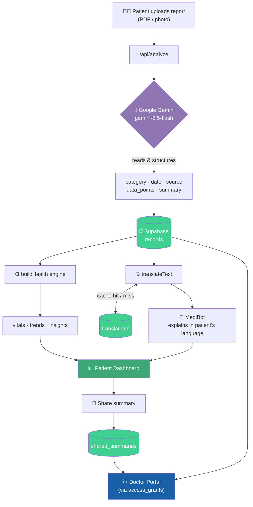

<div align="center">

# 🩺 MediRecord

### Your entire medical history — read, understood, and explained in *your* language.

*Turning chaotic folders of prescriptions, bills, and lab reports into a clear, searchable, multilingual health record — for patients and the doctors who treat them.*

<br/>


[**Live Demo**](#) · [**Report Bug**](https://github.com/wasimat404/medirecord/issues) · [**Request Feature**](https://github.com/wasimat404/medirecord/issues)

</div>

---

## 🌍 The Problem

Anyone under ongoing treatment knows the folder. The one stuffed with prescriptions, lab reports, scan results, and hospital bills that grows thicker with every visit. That folder is a problem for *everyone* who touches it:

- 🧑‍🦱 **Patients** can't make sense of their own history — what's improving, what's getting worse, what a result even *means*.
- 🌐 **Language barriers** make it brutal. A lab report in clinical English is unreadable to a patient who speaks Bengali, Tamil, or Hindi. Critical health information goes un-understood.
- 🩺 **Doctors** waste precious minutes reconstructing a treatment timeline from a paper pile instead of treating.
- 💸 **Insurance** disbursal stalls because nobody can quickly assemble and verify the records.
- 📉 A folder is **dead data** — full of trends and signals that never get surfaced or used.

## ✨ The Solution

**MediRecord** ingests those documents, *reads* them with AI, and turns them into a living, structured, **multilingual** health record.

Upload a report → it's instantly parsed, categorized, summarized, and **translated into the patient's own language** → trends are tracked, the doctor gets a clean view, and a friendly assistant explains it all in plain words. The folder becomes a dashboard.

---

## 📸 Screenshots

> _Drop your screenshots into a `/screenshots` folder and they'll render here._

<div align="center">

### Patient Dashboard


### MediBot — Your Report, Explained in Your Language


| Smart Upload (AI extraction) | Doctor Portal |
| :---: | :---: |
|  |  |

| Document Vault | Health Journey |
| :---: | :---: |
|  |  |

</div>

---

## 🚀 Features

### 🧑‍🦱 For Patients
- **🤖 MediBot translation panel** — an animated assistant that explains your latest report in plain words, in **your** language.
- **🗣️ Native-language records** — every report summary auto-translated into your preferred language. One tap to switch back to English.
- **📂 Document Vault** — prescriptions, lab reports, and bills, auto-sorted and counted.
- **🛤️ Health Journey** — a clean timeline of every visit, result, and prescription.
- **📤 Smart Upload** — snap or drop a document; AI reads it and shows you exactly what it detected (type, provider, date) before saving.
- **💬 Just Ask** *(🚧 in progress)* — ask questions about your own health and get answers grounded in your records, with the source highlighted.
- **🔗 Share with your doctor** — generate a doctor-ready summary of your trends and send it to a linked physician.

### 🩺 For Doctors
- **📊 Clinical dashboard** — auto-generated trend charts and vitals from the patient's uploaded data.
- **🧾 Clinical record + insights** — flagged readings, improving/worsening trends, and plain-language alerts.
- **💊 Prescribe box** — issue prescriptions straight into the patient's record.
- **👥 Patient linking** — securely connect to patients via a shareable patient ID.
- **🔒 Scoped access** — row-level security ensures doctors only ever see patients who've granted them access.

---

## 🧠 How It Works

### 📑 Document Intelligence
Every uploaded PDF or photo is sent to **Google Gemini (`gemini-2.5-flash`)** with a structured extraction prompt. It returns clean JSON:

```json
{
  "category": "blood_test",
  "date": "2026-06-12",
  "source": "Apollo Diagnostics",
  "data_points": [
    { "test": "HbA1c", "value": "7.8", "unit": "%", "normal_range": "4.0-5.6", "flag": "high" }
  ],
  "summary_en": "Plain-language summary the patient can understand..."
}
```

This structured data powers everything downstream — trends, vitals, insights, and the doctor's charts.

### 🌐 Translation Engine
Patient-facing text (report summaries, the MediBot headline) is translated into the patient's chosen language via Gemini, then **cached** in a `translations` table keyed by an MD5 hash of the source. Translate once, serve forever — no repeat API calls, no repeat cost.

**12 languages supported:**
🇮🇳 Bengali · Hindi · Tamil · Telugu · Marathi · Gujarati · Kannada · Malayalam · Punjabi · Urdu · Odia · Assamese — plus English.

> The system **fails open**: if a translation can't be fetched, the patient sees clean English rather than a broken page.

---

## 🏗️ Architecture & Data Flow



---

## 🗄️ Database Schema

| Table | Purpose | Key Columns |
| :--- | :--- | :--- |
| `profiles` | Users (patient / doctor) | `role`, `full_name`, `patient_code`, `preferred_language`, `dob`, `blood_group`, `specialty` |
| `records` | Every uploaded medical document | `patient_id`, `category`, `report_date`, `source`, `data_points` (jsonb), `summary_en` |
| `access_grants` | Doctor ↔ patient links | `doctor_id`, `patient_id` |
| `translations` | Translation cache | `source_hash`, `target_lang`, `source_text`, `translated` |
| `shared_summaries` | Doctor-ready digests sent by patients | `patient_id`, `doctor_id`, `content` (jsonb), `note`, `seen` |

🔐 All tables are protected by **Supabase Row-Level Security** — patients only access their own data; doctors only access patients who've granted them access.

---

## 🛠️ Tech Stack

| Layer | Technology |
| :--- | :--- |
| **Framework** | Next.js (App Router) · React Server Components |
| **Language** | TypeScript |
| **Database & Auth** | Supabase (PostgreSQL + Auth + Row-Level Security) |
| **AI / OCR / Translation** | Google Gemini (`gemini-2.5-flash`) |
| **Styling** | Custom design system (inline styles + hand-built SVG, zero UI deps) |
| **Deployment** | Vercel |

---

## 📁 Project Structure

```
src/
├── app/
│   ├── api/
│   │   ├── analyze/          # Gemini document extraction
│   │   ├── signup/           # Account creation
│   │   ├── link-patient/     # Doctor ↔ patient linking
│   │   └── share-summary/    # Doctor-ready digest generation
│   ├── dashboard/            # Patient experience
│   │   ├── page.tsx          # Two-column dashboard shell
│   │   ├── HealthJourney.tsx # Timeline sidebar
│   │   ├── JustAsk.tsx       # AI Q&A (in progress)
│   │   ├── TranslateBot.tsx  # Animated MediBot translation panel
│   │   ├── DocumentVault.tsx # Category cards
│   │   ├── SmartUpload.tsx   # Upload + live AI extraction preview
│   │   ├── LangToggle.tsx    # Language switcher
│   │   └── Timeline.tsx      # Records list
│   ├── doctor/               # Doctor portal (list, patient view, charts, prescribe)
│   ├── login/  ·  signup/
└── lib/
    ├── gemini.ts             # Gemini client + extraction prompt
    ├── translate.ts          # Cached translation engine (12 languages)
    ├── health.ts             # Trend / vitals / insights derivation
    └── supabaseServer.ts      # Server-side Supabase client
```

---

## ⚡ Getting Started

### Prerequisites
- Node.js 18+
- A [Supabase](https://supabase.com) project
- A [Google AI Studio](https://ai.google.dev) API key (Gemini)

### 1. Clone & install
```bash
git clone https://github.com/wasimat404/medirecord.git
cd medirecord
npm install
```

### 2. Environment variables
Create a `.env.local` in the root:
```bash
NEXT_PUBLIC_SUPABASE_URL=your_supabase_url
NEXT_PUBLIC_SUPABASE_ANON_KEY=your_supabase_anon_key
SUPABASE_SERVICE_ROLE_KEY=your_service_role_key
GEMINI_API_KEY=your_gemini_api_key
```

### 3. Database
Run the SQL in `/supabase` (or your migrations) to create the `profiles`, `records`, `access_grants`, `translations`, and `shared_summaries` tables with their RLS policies.

### 4. Run
```bash
npm run dev
```
Open [http://localhost:3000](http://localhost:3000) 🚀

> 💡 **Note on Gemini quotas:** the free tier allows ~20 requests/day. The translation cache keeps real-world usage low, but for production, enable billing on your Gemini key for higher limits.

---

## 🗺️ Roadmap

- [x] AI document extraction & structuring
- [x] Multilingual record translation (12 languages) with caching
- [x] Patient dashboard — vault, journey, smart upload, MediBot
- [x] Doctor portal — charts, vitals, insights, prescribe
- [x] Share-with-doctor summaries
- [ ] 🚧 **Just Ask** — RAG-powered Q&A over your records with source verification
- [ ] 📱 Native mobile app
- [ ] 🔔 Reminders for medications & follow-ups
- [ ] 🧾 Insurance claim assembly & export

---

## 🤝 Contributing

Contributions, issues, and feature requests are welcome. Feel free to check the [issues page](https://github.com/wasimat404/medirecord/issues).

## 📄 License

Distributed under the MIT License. See `LICENSE` for more information.


⭐ *If this project resonates with you, consider giving it a star!*

*Built to make healthcare make sense — in every language.*

</div>
